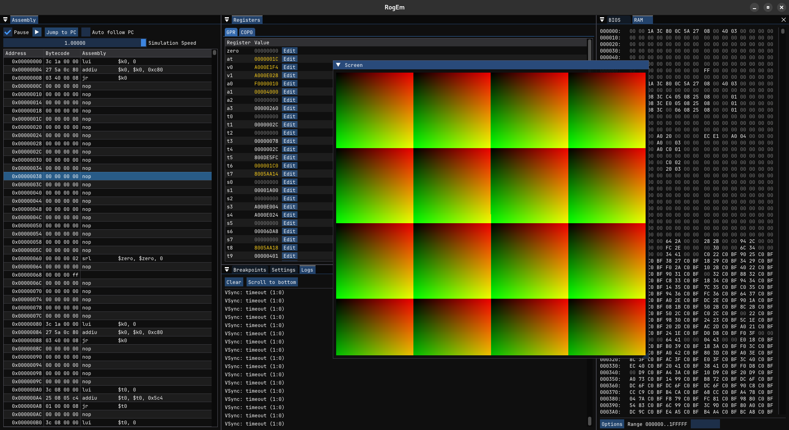
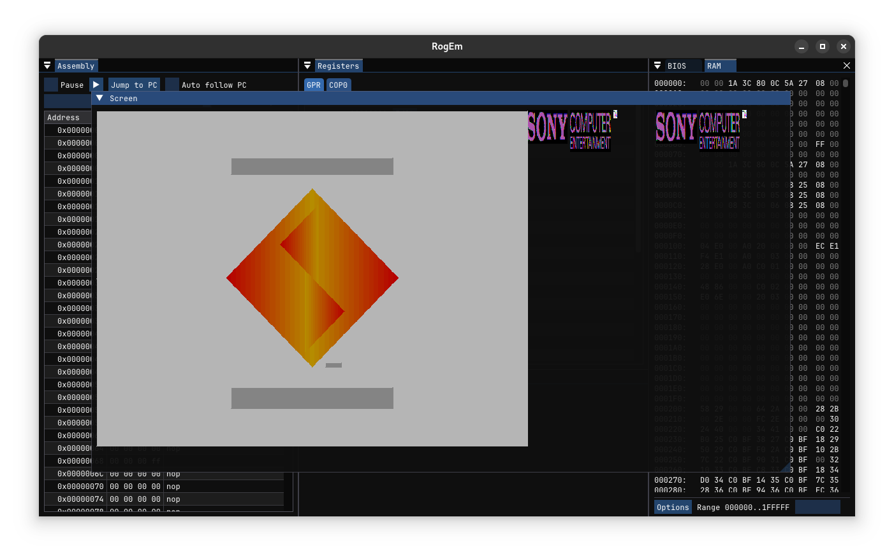

# RogEm

Roger Jr's PS1 emulator

## What is RogEm ?
RogEm is a new generation PS1 emulator that aims to be performant, easy to use and portable between devices.
As gaming habits and game consumption evolve, we wanted to give retro-game players the ability to play on multiple platforms without hassle.
Our goal is to give players the ability to synchronize between **_their_** devices, **_their_** game saves and player data.

## How to contribute
If you have any suggestions, improvements or anything else, please refer to the [contribution guide](CONTRIBUTING.md)

## Completion Checklist
### CPU
- ✅ Instruction decoding — 100%
- ✅ Register file (GPRs, special registers) — 100%
- ✅ Arithmetic and logical instructions — 100%
- ✅ Load/Store instructions — 100%
- ✅ Branch & Jump instructions — 100%
- 🟡 Delay slot handling — 80%
- ✅ Coprocessor (COP0) support — 100%
- 🟡 Exception handling — 80%
- 🟡 GTE (COP2) — 80%

### Memory
- ✅ RAM implementation — 100%
- ✅ BIOS loading — 100%
- ✅ Bus system (with mirroring and mapping) — 100%
- ❌ Cache emulation (if needed) — 0%

### DMA
- ✅ Channels — 100%
- ✅ Ordering Table Clearing — 100%
- ✅ Linked-list transfer (to GPU) — 100%
- 🕒 Burst transfer — 50%
- ❌ Transparent mode — 0%
- ❌ Interrupts — 0%

### GPU
- 🕒 Command processing — 30%
- 🟡 Rendering pipeline — 60%
- 🟡 VRAM emulation — 70%
- 🟡 Display output — 70%

### CD-ROM
- ❌ Basic command parsing — 0%
- ❌ Sector reading — 0%
- ❌ Audio streaming — 0%

### Input
- ❌ Controller input — 0%
- ❌ Memory card support — 0%

### Audio (SPU)
- ❌ Sound channels — 0%
- ❌ DMA to SPU — 0%
- ❌ Audio mixing/output — 0%

### Debugging & Tooling
- ✅ Step-by-step execution — 100%
- ✅ Register & memory viewer — 100%
- ✅ Breakpoints — 100%
- 🟡 Disassembler view — 80%
- ❌ Trace logging — 0%

### Misc
- ✅ Project structure & build system — 100%
- 🕒 Test suite coverage — 70%
- 🕒 Performance profiling — 20%
- ❌ Save state system — 0%

---
_Last updated: 29/06/25_
